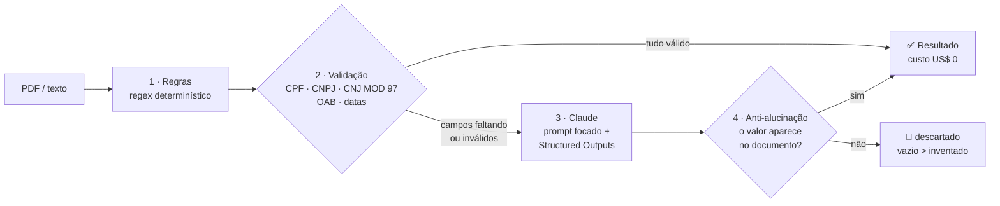
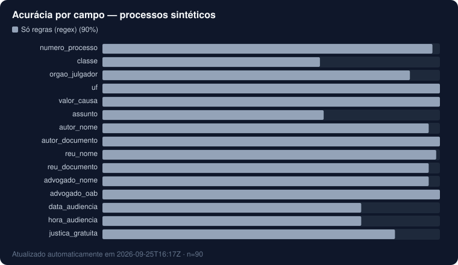

# 🔎 JurisLens

**Um agente de IA que lê processos judiciais brasileiros e devolve dados estruturados.** Usa regras quando elas bastam, chama o Claude só onde precisa e descarta qualquer valor que a matemática ou o próprio documento não confirmem.

[](../../actions/workflows/ci.yml)
[](../../actions/workflows/benchmark.yml)

> ### 👉 Teste agora, sem instalar nada
> [**Abra uma issue**](../../issues/new?template=extrair.yml), escolha *"Gerar um processo sintético pra mim"* e em poucos segundos o bot responde na própria issue com os dados extraídos, a origem de cada campo e a comparação com o gabarito.

---

## O problema

Escritórios e departamentos jurídicos recebem centenas de PDFs do PJe por dia. Alguém precisa copiar à mão número do processo, partes, CPF/CNPJ, valor da causa e data da audiência para o sistema interno. Esse trabalho é lento, caro e cheio de erro de digitação.

Existem duas soluções óbvias, e as duas são ruins sozinhas:

| | Regex puro | LLM puro |
|---|---|---|
| Custo | zero | paga por documento |
| Layout estruturado (capa do PJe) | ótimo | ótimo |
| Petição em prosa ("audiência dia 5 de maio, às 14h30") | falha | ótimo |
| Risco de **inventar** um CPF plausível | nenhum | existe |

O JurisLens junta os dois e acrescenta uma camada que nenhum dos dois tem: **validação**.

## Como funciona



1. **Regras primeiro.** Regex rápido, grátis e auditável. É a evolução de um extrator Flask anterior deste repositório.
2. **Validação matemática.** Cada CPF/CNPJ passa pelo dígito verificador e cada número de processo pelo MOD 97 da Resolução CNJ 65/2008. Datas, horas, UF e OAB também são checadas. O que falha volta para a fila.
3. **IA só no que falta.** O Claude recebe o documento e a lista de campos em que as regras falharam, e responde num schema Pydantic validado (Structured Outputs).
4. **Anti-alucinação.** Todo valor sugerido pela IA precisa passar na validação **e** aparecer no texto. Um CPF válido que não está no documento é descartado.
5. **Auditoria de graça.** Quando a IA já foi chamada, ela também corrige textos que a regra cortou por causa de uma quebra de linha do PDF (`5ª VARA DO SIS` → `5ª VARA DO SISTEMA DOS JUIZADOS...`).

Cada campo sai marcado com a origem: 🧮 regra · 🤖 IA · 🔗 regra + IA · 🚫 descartado.

## Benchmark contínuo

Toda segunda-feira um workflow do GitHub Actions gera o conjunto de teste, roda as três estratégias e **reescreve esta seção sozinho**. Os números abaixo não foram digitados por ninguém.

<!-- BENCH:START -->
_Última execução: **2026-09-25T14:18Z** · 90 processos sintéticos · layouts: capa_pje, intimacao, peticao_inicial_

| Estratégia | Acurácia por campo | Documentos 100% corretos | Chamadas à IA | Custo / 1 mil docs |
|---|---:|---:|---:|---:|
| Só regras (regex) | **89.8%** | 44.4% | 0% | US$ 0.00 |

> As linhas de IA aparecem quando o secret `ANTHROPIC_API_KEY` está configurado no repositório — o workflow semanal preenche sozinho.


<!-- BENCH:END -->

**Por que dados sintéticos?** Processos reais têm nome, CPF e endereço de pessoas reais, e nada disso pode ir para um repositório público (LGPD). O [`synth.py`](jurislens/synth.py) gera processos fictícios em três layouts reais do PJe (capa, petição inicial em prosa e intimação), com documentos de dígito verificador válido e com o ruído típico de PDF extraído: palavras cortadas por quebra de linha, cabeçalhos de assinatura e espaços duplos. Cada documento vem com gabarito.

## Rodando localmente

```bash
pip install -e ".[dev]"

python -m jurislens synth -n 90           # gera data/synthetic.jsonl
python -m jurislens extract processo.txt  # extrai (usa IA se ANTHROPIC_API_KEY existir)
python -m jurislens extract processo.txt --no-llm --redact
python -m jurislens bench                 # roda o benchmark e atualiza este README
pytest
```

Exemplo real de saída (petição em prosa, modo `--no-llm --redact`). Os campos marcados como `ausente` são justamente os que o modo híbrido mandaria para o Claude:

```json
{
  "dados": {
    "numero_processo": "8643174-20.2026.8.16.0266",
    "classe": null,
    "orgao_julgador": "7A VARA DO SISTEMA DOS JUIZADOS ESPECIAIS DE CURITIBA",
    "valor_causa": 29000.0,
    "autor_documento": "***.010.***-**",
    "reu_documento": "93.319.***/****-**",
    "data_audiencia": null,
    "...": "..."
  },
  "origem": { "numero_processo": "regra", "classe": "ausente", "data_audiencia": "ausente", "...": "..." },
  "descartados_pela_validacao": {},
  "custo_usd": 0.0
}
```

## Automações no GitHub

| Workflow | O que faz |
|---|---|
| [`issue-bot.yml`](.github/workflows/issue-bot.yml) | Responde issues com a extração. Tem limite de uso por pessoa e por dia; passado o limite, responde só com regras (custo zero). |
| [`benchmark.yml`](.github/workflows/benchmark.yml) | Toda semana mede as três estratégias e faz commit dos resultados no README, em `results/` e no site. |
| [`pages.yml`](.github/workflows/pages.yml) | Publica o [site](site/index.html) com o benchmark ao vivo e um validador de CNJ/CPF/CNPJ que roda no navegador. |
| [`ci.yml`](.github/workflows/ci.yml) | Testes, incluindo um cliente Claude simulado que prova que a trava anti-alucinação funciona. |

## Estrutura

```
jurislens/
  rules.py        regex por campo (baseline)
  validators.py   CPF, CNPJ, CNJ (MOD 97-10), OAB
  llm.py          Claude + Structured Outputs (Pydantic)
  hybrid.py       orquestração, ancoragem e auditoria
  synth.py        gerador de processos sintéticos com gabarito
  bench.py        benchmark, gráfico SVG e reescrita do README
  redact.py       mascaramento LGPD de CPF/CNPJ
  github_bot.py   bot de issues
```

## Configuração (para quem fizer fork)

1. **Settings → Secrets → Actions**: crie `ANTHROPIC_API_KEY`. Sem ele, tudo funciona em modo só regras.
2. **Settings → Pages → Source**: *GitHub Actions*.
3. Opcional: `JURISLENS_MODEL` (padrão `claude-opus-5`) e `JURISLENS_EFFORT` (padrão `low`) para trocar modelo e esforço.

---

Feito por [@leandreta](https://github.com/leandreta): automação, IA aplicada e processos jurídicos. Se isso resolveria um problema no seu time, vamos conversar.
